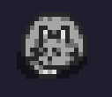
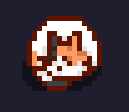
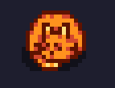
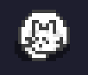

## A Electronic pet cat written in Java
The material is based on the [Stardew Valley](https://stardewvalleywiki.com/Animals#Cat_or_Dog)
which is a well known business simulation game.

### Preview

### Prerequisite
- Java 21

There are currently four types of cat skins.

### British short hair cat

### Calico cat

### Orange cat

### Persian cat

Have fun and enjoy! :)

ο(=•ω＜=)ρ⌒☆